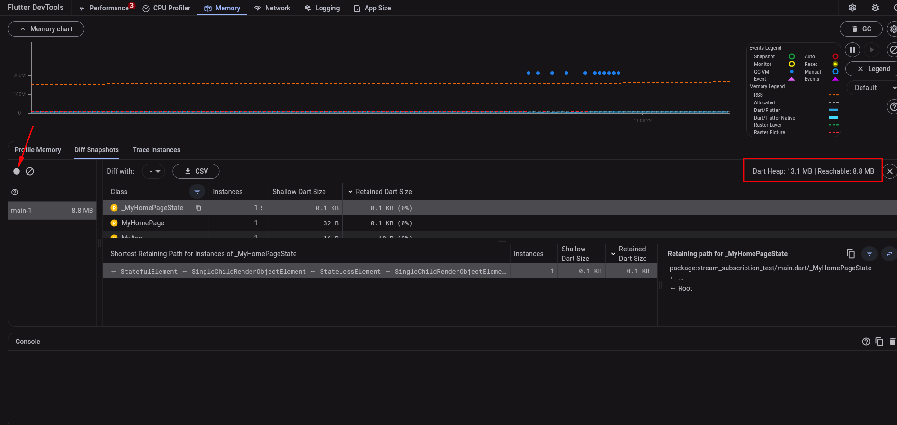
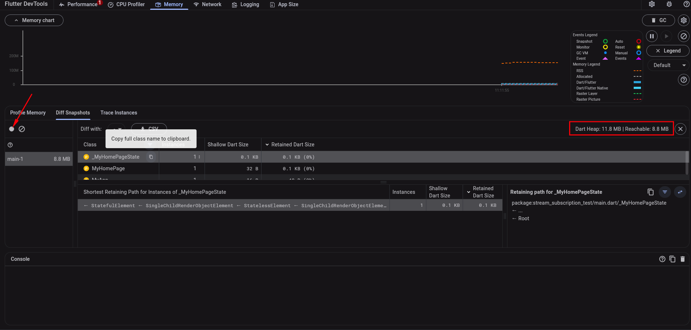

# stream_subscription_test

## Test memory usage

### Step 1: Collect memory usage without cancelling stream subscription

1. run the app in the `profile` mode.
2. open the `DevTools`.
3. go to the `Memory` tab.
4. go to the `Diff snapshots` tab in the `Memory` tab.
5. input `5000` in the `Creation subs num` field.
6. create stream subscriptions without storing: tap on the `Create N subs` text button.
7. close the stream controller: tap on the `Close controller` text button.
8. click on the `Take heap snapshot for the selected isolate` icon and remember `Dart Heap` and `Reachable memory`
   value.
   

### Step 2: Collect memory usage with cancelling stream subscription

1. run the app in the `profile` mode.
2. open the `DevTools`.
3. go to the `Memory` tab.
4. go to the `Diff snapshots` tab in the `Memory` tab.
5. input `5000` in the `Creation subs num` field.
6. create stream subscriptions with storing: tap on the `Create and store N subs` text button.
7. cancel the stream subscriptions: tap on the `Cancel stored subs` text button.
8. close the stream controller: tap on the `Close controller` text button.
9. click on the `Take heap snapshot for the selected isolate` icon and remember `Dart Heap` and `Reachable memory`
   value.
   

### Step 3: Compare the `Dart Heap` and `Reachable memory` results of Step 1 and Step 2

**Result**:

- the case without stream subscriptions usually allocates more `Dart Heap` memory.
- the `Reachable memory` are usually the same.
- there is a chance that there is more `Unreachable memory` in the case without stream subscriptions.
- BUT in some test cases there is not much difference, so it is hard to say exactly in this test scenario.

## Test how processing event is handling after stream controller was closed

### Case 1: Without cancelling stream subscription:

1. run the app.
2. create stream subscriptions without storing: tap on the `Create N subs` text button.
3. emit an event with delay: tap on the `Emit delayed event` text button.
4. close the stream controller: tap on the `Close controller` text button.

**Test Result**:

- The processing event still be process after the stream controller was closed.<br>
  So all references in the method are kept in memory until the event is processed
- the `onDone` event will be processed.

```
[log] 2023-11-20 10:48:29.314902: Start onEvent with someLargeMemoryObject
[log] 2023-11-20 10:48:30.755355: onDone event - Stream is closed
[log] 2023-11-20 10:48:39.324085: Finish onEvent with someLargeMemoryObject
```

### Case 2: With cancelling stream subscription

1. run the app.
2. create stream subscriptions with storing: tap on the `Create and store N subs` text button.
3. emit an event with delay: tap on the `Emit delayed event` text button.
4. cancel the stream subscriptions: tap on the `Cancel stored subs` text button.
5. close the stream controller: tap on the `Close controller` text button.

**Test Result**:

- The processing event still be process after the stream controller was closed.<br>
  So all references in the method are kept in memory until the event is processed
- the `onDone` event will not be processed.

```
[log] 2023-11-20 10:49:13.428155: Start onEvent with someLargeMemoryObject
[log] 2023-11-20 10:49:18.437833: Finish onEvent with someLargeMemoryObject
```